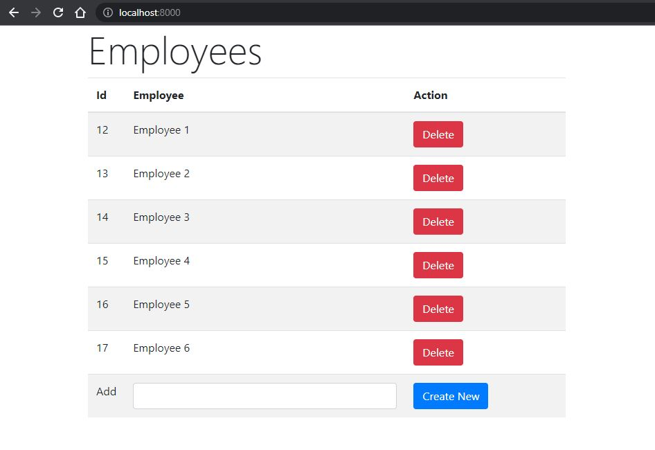

# Assessment-Pyt0101

"The task is to develop a simple API using Python FASTAPI framework that would process input data, communicate with a database andreturn results to the client.Employee API -will support 2 operations:

1. Create an Employee record. This operation will take 2 parameters-a String and an int.String value will populate the emp_name, integervalue will populate emp_id value. Do not worry about data validation etc.
2. Return all Employee values tothe client. Any format is fine.
3. Demonstrate how you maintain the application code in a Git Repository 
4. Document the usage of the API as part of the Git Readme.md 

Bonus task 1: Create a Timesheet API that uses data from the Employee API.  When recording a time sheet entry, make sureyou pull Employee data from the Employee API.
Bonus task 2: Develop a simple UI that can be used directly from the web browser to drive the API -any stack will do, from plain HTML forms to JQuery to Angular/React/et"

## Installation

1. You need an instance of MySQL Server running in your localhost
2. Create a new data base and name it: prueba-emonics
3. Create a Python Virtual Enviroment in the project folder
```bash
#Windows, Linux and Mac with venv
python -m venv venv
```
2. Activate the virtual enviroment for __Python 3.10__   

```bash

#Linux and Mac:
source venv/bin/activate

#Windows:
venv/Scripts/activate.bat

```
3. Install dependences in the virtual enviroment  
```bash
pip install requisites.txt
```
4. Run the server Uvicorn
```bash
uvicorn app:app --reload
```
5. open the next url in your browser and check the API endpoints working
```bash
localhost:8000/docs/
```

## Web Interface
  
Exist a basic user interface in the root path: localhost:8000/. You can create new records of Employees and delete them one by one.
  
